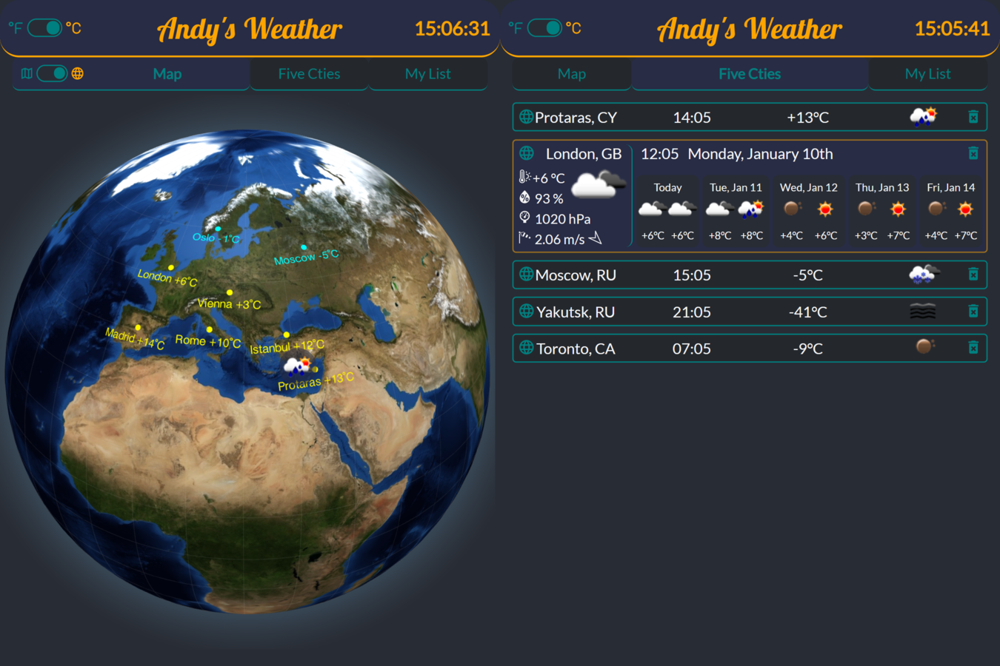

# Andy's Weater App

After completing several React tutorials I'm putting my newly gained skills to the test in order to develop React Weather App from scratch, with dynamic interactive interface. 
Its interface consists of three tabs, one for the list of five pre-defined cities, another one allows user to create custom list, and the last one to display interactive Earth Globe/Map.

## Key features:

- functional components
- consuming OpenWeatherMap API with AXIOS.
- react-router-dom v6
- pigeon-map
- react-globe.gl
- Drag & Drop
- responsive design & animations for better UX